# OmniParser - Universal Document Parser

[](https://github.com/AutumnsGrove/omniparser)
[](https://www.python.org/)
[](LICENSE)
[]()

> **Any document → clean markdown.**
>
> OmniParser transforms documents, web pages, and structured data into standardized markdown with comprehensive metadata extraction. Connect it to your pipelines, tools, or workflows—anywhere you need intelligent document ingestion.

---

## Supported Formats

| Format | Status | Key Features |
|--------|--------|--------------|
| 📖 **EPUB** | ✅ Production | TOC-based chapters, metadata, image extraction |
| 🌐 **HTML/URL** | ✅ Production | Semantic parsing, live URL fetching, parallel image downloads |
| 📄 **PDF** | ✅ Production | Multi-column layout, tables, images, **QR code detection** |
| 📝 **DOCX** | ✅ Production | Tables, lists, hyperlinks, images, metadata |
| 📋 **Markdown** | ✅ Production | Frontmatter parsing, code blocks, link preservation |
| 📃 **Text** | ✅ Production | Auto chapter detection, encoding handling |

**Extensions:** `.epub`, `.pdf`, `.html`, `.htm`, `.docx`, `.md`, `.markdown`, `.txt`, and URLs

---

## Quick Start

### Installation

```bash
# Basic installation
pip install omniparser

# With AI features
pip install omniparser[ai]

# Development (from source)
git clone https://github.com/AutumnsGrove/omniparser.git
cd omniparser
uv sync
```

### Basic Usage

```python
from omniparser import parse_document

# Parse any supported format - automatic detection
doc = parse_document("book.epub")
doc = parse_document("report.pdf")
doc = parse_document("https://example.com/article")

# Access results
print(f"Title: {doc.metadata.title}")
print(f"Author: {doc.metadata.author}")
print(f"Chapters: {len(doc.chapters)}")
print(f"Word count: {doc.word_count}")
print(f"Reading time: {doc.estimated_reading_time} min")

# Iterate through content
for chapter in doc.chapters:
    print(f"  {chapter.title} ({chapter.word_count} words)")
```

---

## Architecture Overview

```mermaid
flowchart TB
    subgraph Input["📥 Input Sources"]
        EPUB[".epub"]
        PDF[".pdf"]
        HTML[".html / URL"]
        DOCX[".docx"]
        MD[".md"]
        TXT[".txt"]
    end

    subgraph Core["🔧 OmniParser Core"]
        API["parse_document()"]
        FD["Format Detector"]

        subgraph Parsers["Format Parsers"]
            EP["EPUB Parser"]
            PP["PDF Parser"]
            HP["HTML Parser"]
            DP["DOCX Parser"]
            MP["Markdown Parser"]
            TP["Text Parser"]
        end

        subgraph Processors["Post-Processors"]
            CD["Chapter Detector"]
            TC["Text Cleaner"]
            ME["Metadata Extractor"]
            QR["QR Code Detector"]
        end
    end

    subgraph Output["📤 Universal Output"]
        DOC["Document Model"]
        CH["Chapters"]
        IMG["Images"]
        META["Metadata"]
        QROUT["QR Codes"]
    end

    Input --> API
    API --> FD
    FD --> Parsers
    Parsers --> Processors
    Processors --> Output
```



---

## QR Code Detection

OmniParser can detect and extract QR codes from PDFs and images, automatically fetching content from URL-encoded QR codes.

### PDF QR Code Scanning

```python
from omniparser import parse_document

doc = parse_document("document.pdf", {
    "detect_qr_codes": True,      # Enable detection
    "qr_fetch_urls": True,        # Fetch URL content
    "qr_timeout": 15,             # Fetch timeout (seconds)
    "qr_dpi": 150                 # Page rendering DPI
})

# Access detected QR codes
for qr in doc.qr_codes:
    print(f"QR {qr.qr_id}: {qr.data_type} - {qr.raw_data}")
    if qr.fetched_content:
        print(f"  Content: {qr.fetched_content[:100]}...")
```

### Standalone Image Scanning

```python
from omniparser.processors.qr_detector import scan_image_for_qr_and_fetch

# Scan any image for QR codes
qr_codes, warnings = scan_image_for_qr_and_fetch(
    "image.png",
    fetch_urls=True,
    timeout=15
)

for qr in qr_codes:
    print(f"{qr.data_type}: {qr.raw_data}")
```

### QR Code Data Flow


### Supported QR Data Types

| Type | Description | Auto-Fetched |
|------|-------------|--------------|
| `URL` | Web links (http://, https://) | ✅ Yes |
| `EMAIL` | Email addresses | ❌ No |
| `PHONE` | Phone numbers | ❌ No |
| `WIFI` | WiFi configuration | ❌ No |
| `VCARD` | Contact cards | ❌ No |
| `GEO` | Geographic coordinates | ❌ No |
| `SMS` | SMS messages | ❌ No |
| `TEXT` | Plain text | ❌ No |

### Requirements

```bash
# Install pyzbar Python package
pip install pyzbar

# Install system library
# Ubuntu/Debian
apt-get install libzbar0

# macOS
brew install zbar

# Windows - included with pyzbar wheel
```

---

## AI-Powered Features

Optional AI processing with multiple provider support.

### Supported Providers

| Provider | Type | Best For |
|----------|------|----------|
| **Anthropic Claude** | ☁️ Cloud | Vision tasks, high-quality analysis |
| **OpenAI GPT** | ☁️ Cloud | General purpose, good performance |
| **OpenRouter** | ☁️ Cloud | Access multiple models via one API |
| **Ollama** | 🏠 Local | Privacy, no API costs, offline |
| **LM Studio** | 🏠 Local | Privacy, no API costs, offline |

### Available Features

- **Auto-Tagging** - Generate relevant tags from content
- **Summarization** - Concise, detailed, or bullet-point summaries
- **Image Analysis** - OCR, classification, object detection
- **Image Description** - Alt text and detailed descriptions
- **Quality Scoring** - Readability, structure, completeness assessment

### Usage

```python
from omniparser import parse_document
from omniparser.processors.ai_tagger import generate_tags
from omniparser.processors.ai_summarizer import summarize_document
from omniparser.utils.config import get_ai_options, load_config

doc = parse_document("book.epub")

# Configure AI provider
config = load_config()
ai_options = get_ai_options("anthropic", config)

# Generate tags
tags = generate_tags(doc, max_tags=10, ai_options=ai_options)

# Create summary
summary = summarize_document(doc, style="concise", ai_options=ai_options)
```

### Setup

```bash
# Install AI dependencies
pip install omniparser[ai]
# or
uv sync --extra ai

# Configure API keys
cp secrets_template.json secrets.json
# Edit secrets.json with your API keys
```

---

## Data Models

All parsers output consistent data structures:


---

## Examples

### EPUB to Markdown

```python
from omniparser import parse_document

doc = parse_document("book.epub", {
    "extract_images": True,
    "image_output_dir": "./images"
})

# Generate markdown with frontmatter
markdown = f"""---
title: {doc.metadata.title}
author: {doc.metadata.author}
words: {doc.word_count}
---

# {doc.metadata.title}

"""

for chapter in doc.chapters:
    markdown += f"## {chapter.title}\n\n{chapter.content}\n\n"
```

### PDF with Tables and Images

```python
doc = parse_document("report.pdf", {
    "extract_images": True,
    "detect_qr_codes": True,
    "qr_fetch_urls": True
})

print(f"Pages processed: {doc.processing_info.options_used.get('page_count', 'N/A')}")
print(f"Images found: {len(doc.images)}")
print(f"QR codes found: {len(doc.qr_codes)}")
```

### Web Article Scraping

```python
doc = parse_document("https://example.com/article", {
    "extract_images": True,
    "max_image_workers": 10,
    "rate_limit_delay": 0.5
})

print(f"Title: {doc.metadata.title}")
print(f"Content length: {doc.word_count} words")
```

### Batch Processing

```python
from pathlib import Path
from omniparser import parse_document

documents = []
for file in Path("./docs").glob("**/*"):
    if file.suffix in ['.epub', '.pdf', '.docx', '.md', '.txt']:
        doc = parse_document(str(file))
        documents.append(doc)

total_words = sum(d.word_count for d in documents)
print(f"Processed {len(documents)} documents ({total_words} words)")
```

---

## Performance

| Parser | Benchmark | Result |
|--------|-----------|--------|
| EPUB | 5MB file | ~0.25 seconds (20x faster than target) |
| HTML | Live URL fetch | <0.2 seconds |
| PDF | Complex layout | Varies by page count |
| All | Test suite | 1,049 tests passing |

---

## Development

### Running Tests

```bash
# All tests
uv run pytest

# With coverage
uv run pytest --cov=omniparser --cov-report=html

# Specific parser
uv run pytest tests/unit/test_pdf_parser.py
```

### Code Quality

```bash
# Format code
uv run black src/ tests/

# Type checking
uv run mypy src/

# Build package
uv build
```

### Adding a New Parser

1. Create `src/omniparser/parsers/new_parser.py`
2. Inherit from `BaseParser`
3. Implement `parse()` and `supports_format()`
4. Add tests in `tests/unit/test_new_parser.py`
5. Register in `src/omniparser/parser.py`

---

## Project Structure

```
src/omniparser/
├── __init__.py              # Package exports
├── parser.py                # Main parse_document() entry point
├── models.py                # Data models (Document, Chapter, etc.)
├── exceptions.py            # Custom exceptions
├── base/                    # Abstract base classes
├── parsers/                 # Format-specific parsers
│   ├── epub/               # EPUB parser (10 modules)
│   ├── pdf/                # PDF parser (9 modules)
│   ├── docx/               # DOCX parser (12 modules)
│   ├── html/               # HTML parser (8 modules)
│   ├── markdown/           # Markdown parser (7 modules)
│   └── text/               # Text parser (6 modules)
├── processors/              # Post-processing & AI
│   ├── qr_detector.py      # QR code detection
│   ├── qr_content_merger.py
│   ├── qr_url_fetcher.py
│   ├── ai_tagger.py
│   ├── ai_summarizer.py
│   └── ...
└── utils/                   # Utilities
```

---

## Dependencies

### Core
- `ebooklib` - EPUB parsing
- `PyMuPDF` - PDF text/image extraction
- `python-docx` - DOCX parsing
- `beautifulsoup4`, `lxml` - HTML parsing
- `trafilatura`, `readability-lxml` - Content extraction
- `pyzbar` - QR code detection
- `Pillow` - Image processing
- `requests` - HTTP requests

### AI (Optional)
- `anthropic` - Claude API
- `openai` - OpenAI API

### Development
- `pytest`, `pytest-cov` - Testing
- `black` - Formatting
- `mypy` - Type checking

---

## Documentation

| Document | Description |
|----------|-------------|
| [ARCHITECTURE_PLAN.md](docs/ARCHITECTURE_PLAN.md) | Complete implementation blueprint (40k words) |
| [IMPLEMENTATION_REFERENCE.md](docs/IMPLEMENTATION_REFERENCE.md) | Developer quick reference |
| [ARCHITECTURE_DIAGRAMS.md](docs/ARCHITECTURE_DIAGRAMS.md) | Visual architecture reference |
| [OMNIPARSER_PROJECT_SPEC.md](docs/OMNIPARSER_PROJECT_SPEC.md) | Technical specification |

---

## Changelog Highlights

### v0.3.0 (Current)
- ✅ **QR code detection** in PDFs and images with URL fetching
- ✅ **Wayback Machine fallback** for unavailable URLs
- ✅ **DOCX lists and hyperlinks** extraction
- ✅ **All 6 parsers** production-ready
- ✅ **1,049 tests** passing

### v0.2.0
- HTML/URL parser with parallel image downloads
- PDF parser with multi-column layout detection
- DOCX, Markdown, Text parsers

### v0.1.0
- Initial EPUB parser release
- Core data models and architecture

---

## Contributing

```bash
# Setup development environment
git clone https://github.com/AutumnsGrove/omniparser.git
cd omniparser
uv sync --dev

# Run tests before submitting
uv run pytest
uv run black src/ tests/
uv run mypy src/
```

See [CLAUDE.md](CLAUDE.md) for detailed development guidelines.

---

## License

MIT License - See [LICENSE](LICENSE) for details.

---

## Links

- **Repository:** https://github.com/AutumnsGrove/omniparser
- **Issues:** https://github.com/AutumnsGrove/omniparser/issues

---

**OmniParser v0.3.0** | 6 Parsers + AI Features + QR Code Detection | Production Ready
