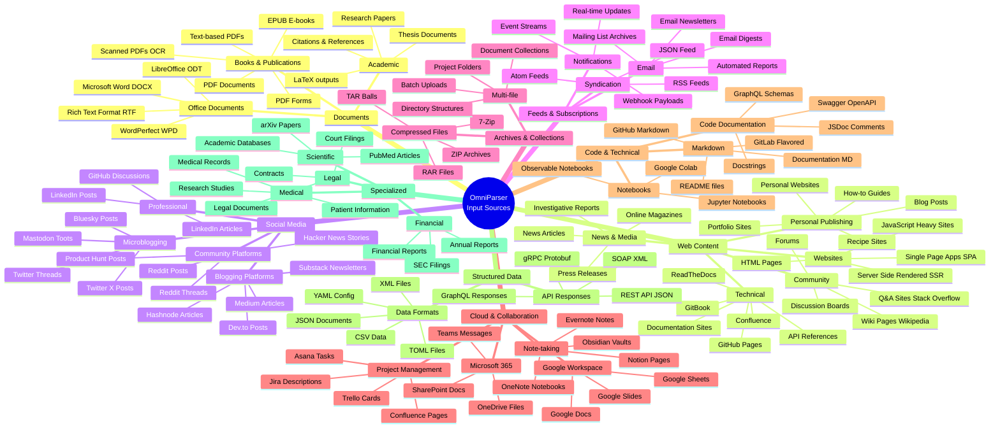
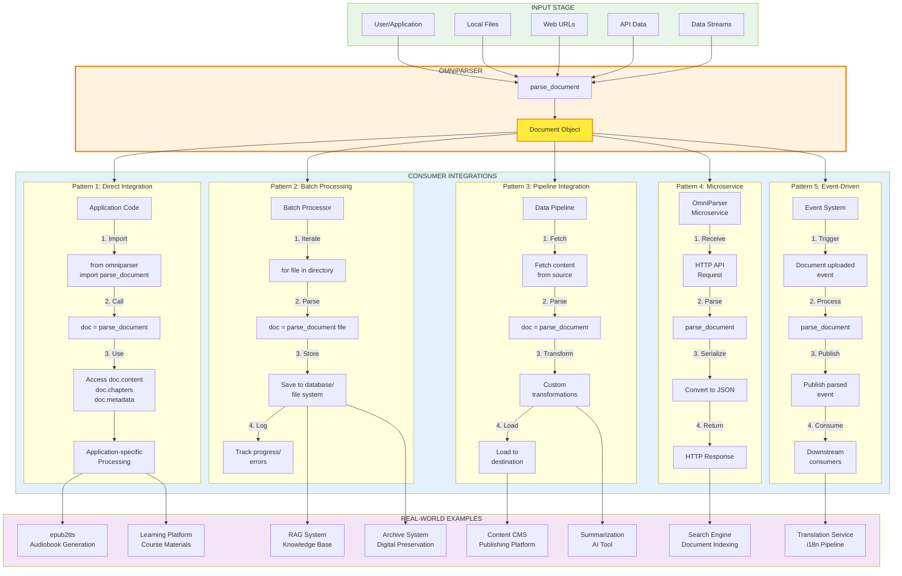
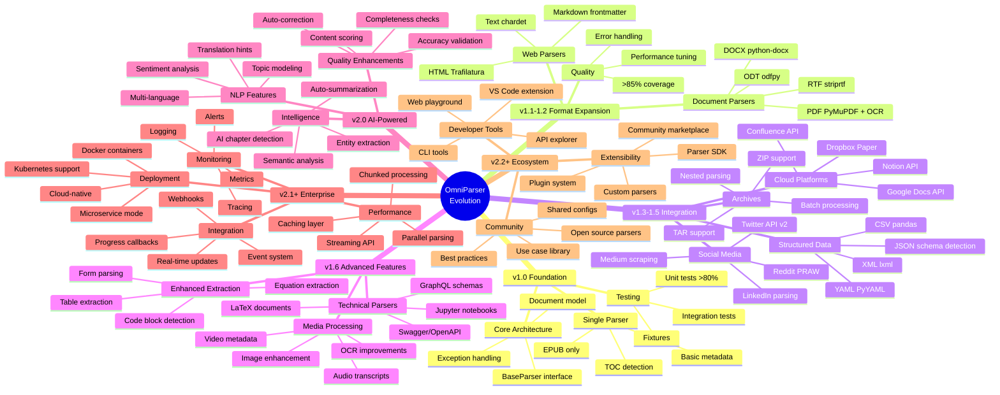

# OmniParser: Comprehensive Workflow & Architecture
**Universal Content Ingestion Platform**

**Version:** 2.0 (Expanded Vision)
**Date:** 2025-10-17
**Status:** Architecture Design

---

## Table of Contents
1. [System Overview](#system-overview)
2. [Input Source Taxonomy](#input-source-taxonomy)
3. [Parser Routing & Selection](#parser-routing--selection)
4. [Processing Pipeline](#processing-pipeline)
5. [Integration Patterns](#integration-patterns)
6. [Future Roadmap](#future-roadmap)

---

## System Overview

### Complete End-to-End Flow

```mermaid
graph TB
    subgraph InputSources["INPUT SOURCES (20+ Types)"]
        direction LR

        subgraph Documents["📄 Documents"]
            EPUB[EPUB Books]
            PDF[PDFs]
            DOCX[Word Docs]
            ODT[LibreOffice]
            RTF[Rich Text]
        end

        subgraph Web["🌐 Web Content"]
            URL[Website URLs]
            News[News Articles]
            Blogs[Blog Posts]
            Recipes[Recipe Sites]
            Docs[Documentation]
            Wiki[Wikis]
        end

        subgraph Social["📱 Social Media"]
            Twitter[Twitter/X Posts]
            Reddit[Reddit Threads]
            LinkedIn[LinkedIn Articles]
            Medium[Medium Posts]
            Substack[Substack Newsletters]
        end

        subgraph Feeds["📡 Feeds & APIs"]
            RSS[RSS/Atom Feeds]
            Email[Email Newsletters]
            JSON[JSON APIs]
            XML[XML Data]
        end

        subgraph Archives["📦 Archives"]
            ZIP[ZIP Files]
            TAR[TAR Archives]
            Multi[Multi-file Collections]
        end

        subgraph Cloud["☁️ Cloud Storage"]
            GDocs[Google Docs]
            Notion[Notion Pages]
            Confluence[Confluence]
            Dropbox[Dropbox Paper]
        end

        subgraph Code["💻 Code & Tech"]
            Markdown[Markdown Files]
            README[README Files]
            Jupyter[Jupyter Notebooks]
            TechDocs[Technical Docs]
        end

        subgraph Other["📋 Other"]
            TXT[Plain Text]
            CSV[Structured Data]
            Custom[Custom Formats]
        end
    end

    subgraph OmniParser["🎯 OMNIPARSER CORE"]
        direction TB

        Detect[Format Detection<br/>• MIME types<br/>• Content sniffing<br/>• API identification]

        Route[Parser Selection<br/>• 15+ parsers<br/>• Format-specific<br/>• Fallback chain]

        Extract[Content Extraction<br/>• Text parsing<br/>• Structure detection<br/>• Metadata extraction]

        Process[Post-Processing<br/>• Chapter detection<br/>• Image extraction<br/>• Text cleaning<br/>• Markdown conversion]

        Build[Document Assembly<br/>• Unified structure<br/>• Standardized output<br/>• Quality validation]

        Detect --> Route
        Route --> Extract
        Extract --> Process
        Process --> Build
    end

    subgraph Consumers["📤 CONSUMERS & INTEGRATIONS"]
        direction LR

        subgraph Audio["🎧 Audio Generation"]
            TTS[epub2tts<br/>Audiobook Creation]
            Podcast[Podcast Generation]
        end

        subgraph AI["🤖 AI & Knowledge"]
            RAG[RAG Systems<br/>Knowledge Bases]
            LLM[LLM Fine-tuning<br/>Dataset Creation]
            Embeddings[Vector Embeddings<br/>Semantic Search]
        end

        subgraph Content["📝 Content Management"]
            CMS[Content Systems<br/>Publishing]
            Archive[Digital Archives<br/>Preservation]
            Translation[Translation Services<br/>i18n]
        end

        subgraph Analysis["📊 Analysis & Tools"]
            Search[Search Indexing<br/>Elasticsearch]
            Summary[Summarization<br/>AI Tools]
            Analytics[Content Analytics<br/>Insights]
        end
    end

    Documents --> Detect
    Web --> Detect
    Social --> Detect
    Feeds --> Detect
    Archives --> Detect
    Cloud --> Detect
    Code --> Detect
    Other --> Detect

    Build --> TTS
    Build --> Podcast
    Build --> RAG
    Build --> LLM
    Build --> Embeddings
    Build --> CMS
    Build --> Archive
    Build --> Translation
    Build --> Search
    Build --> Summary
    Build --> Analytics

    style InputSources fill:#e3f2fd,stroke:#1976d2,stroke-width:3px
    style OmniParser fill:#fff3e0,stroke:#f57c00,stroke-width:4px
    style Consumers fill:#f3e5f5,stroke:#7b1fa2,stroke-width:3px

    style Detect fill:#a5d6a7
    style Route fill:#90caf9
    style Extract fill:#ffcc80
    style Process fill:#ce93d8
    style Build fill:#81c784
```



---

## Input Source Taxonomy

### Detailed Source Classification



---

## Parser Routing & Selection

### Intelligent Parser Selection Flow

```mermaid
flowchart TD
    Start([Input Received<br/>file_path | URL | API data])

    CheckType{Input Type?}

    Start --> CheckType

    %% File Path Branch
    CheckType -->|File Path| ValidateFile{File<br/>Exists &<br/>Readable?}
    ValidateFile -->|No| ErrFile([FileReadError])
    ValidateFile -->|Yes| DetectFormat[Detect Format<br/>• Magic bytes MIME<br/>• Extension fallback<br/>• Content sampling]

    %% URL Branch
    CheckType -->|URL| ValidateURL{Valid<br/>URL?}
    ValidateURL -->|No| ErrURL([ValidationError])
    ValidateURL -->|Yes| FetchContent[Fetch Content<br/>• HTTP/HTTPS<br/>• User-agent<br/>• Timeout handling]
    FetchContent --> DetectWeb{Content<br/>Type?}

    DetectWeb -->|HTML| WebParser
    DetectWeb -->|JSON| JSONParser
    DetectWeb -->|XML| XMLParser
    DetectWeb -->|RSS/Atom| FeedParser
    DetectWeb -->|Other| ContentSniff[Content<br/>Sniffing]
    ContentSniff --> DetectFormat

    %% API Data Branch
    CheckType -->|API Data| DetectAPI{Data<br/>Format?}
    DetectAPI -->|JSON| JSONParser
    DetectAPI -->|XML| XMLParser
    DetectAPI -->|Text| TextParser

    %% Format Detection to Parser Selection
    DetectFormat --> SelectParser{Format<br/>Identified?}

    SelectParser -->|epub| EPUBParser[📕 EPUB Parser<br/>ebooklib-based<br/>TOC detection<br/>Chapter extraction]
    SelectParser -->|pdf| PDFParser[📄 PDF Parser<br/>PyMuPDF + OCR<br/>Text/scanned<br/>Table extraction]
    SelectParser -->|docx| DOCXParser[📝 DOCX Parser<br/>python-docx<br/>Style-based chapters<br/>Image extraction]
    SelectParser -->|odt| ODTParser[📄 ODT Parser<br/>LibreOffice<br/>ODF structure<br/>Metadata]
    SelectParser -->|rtf| RTFParser[📄 RTF Parser<br/>striprtf<br/>Basic formatting<br/>Text extraction]
    SelectParser -->|html| WebParser[🌐 Web Parser<br/>Trafilatura<br/>Readability<br/>Main content]
    SelectParser -->|markdown| MarkdownParser[📝 Markdown Parser<br/>Frontmatter<br/>Heading detection<br/>Code blocks]
    SelectParser -->|txt| TextParser[📄 Text Parser<br/>chardet encoding<br/>Minimal processing<br/>Single chapter]
    SelectParser -->|json| JSONParser[🔧 JSON Parser<br/>Schema detection<br/>Structured extraction<br/>Field mapping]
    SelectParser -->|xml| XMLParser[🔧 XML Parser<br/>lxml<br/>XPath queries<br/>Structure parsing]
    SelectParser -->|csv| CSVParser[📊 CSV Parser<br/>pandas<br/>Column detection<br/>Tabular data]
    SelectParser -->|zip/tar| ArchiveParser[📦 Archive Parser<br/>Extract & iterate<br/>Nested parsing<br/>Batch processing]
    SelectParser -->|jupyter| NotebookParser[💻 Notebook Parser<br/>nbformat<br/>Cell extraction<br/>Code + markdown]
    SelectParser -->|unknown| FallbackChain[Fallback Chain<br/>1. Try text parser<br/>2. Try encoding detection<br/>3. Sample-based guess]

    FallbackChain -->|Success| TextParser
    FallbackChain -->|Fail| ErrUnsupported([UnsupportedFormatError])

    %% Social Media Special Branch
    CheckType -->|Social Media| DetectPlatform{Platform?}
    DetectPlatform -->|Twitter/X| TwitterParser[🐦 Twitter Parser<br/>API v2<br/>Thread detection<br/>Media extraction]
    DetectPlatform -->|Reddit| RedditParser[🔴 Reddit Parser<br/>PRAW<br/>Comment threads<br/>Submission content]
    DetectPlatform -->|LinkedIn| LinkedInParser[💼 LinkedIn Parser<br/>Web scraping<br/>Article extraction<br/>Post content]
    DetectPlatform -->|Medium| MediumParser[📰 Medium Parser<br/>Article scraping<br/>Paywall handling<br/>Rich content]

    %% Feed Branch
    CheckType -->|Feed URL| FeedParser[📡 Feed Parser<br/>feedparser<br/>RSS/Atom<br/>Entry extraction]

    %% All parsers converge to processing
    EPUBParser --> PostProcess
    PDFParser --> PostProcess
    DOCXParser --> PostProcess
    ODTParser --> PostProcess
    RTFParser --> PostProcess
    WebParser --> PostProcess
    MarkdownParser --> PostProcess
    TextParser --> PostProcess
    JSONParser --> PostProcess
    XMLParser --> PostProcess
    CSVParser --> PostProcess
    ArchiveParser --> PostProcess
    NotebookParser --> PostProcess
    TwitterParser --> PostProcess
    RedditParser --> PostProcess
    LinkedInParser --> PostProcess
    MediumParser --> PostProcess
    FeedParser --> PostProcess

    PostProcess[📋 Post-Processing<br/>• Chapter detection<br/>• Metadata extraction<br/>• Image processing<br/>• Text cleaning]

    PostProcess --> BuildDoc[🏗️ Build Document<br/>• Universal structure<br/>• Validation<br/>• Quality checks]

    BuildDoc --> Output([📦 Document Object<br/>• content markdown<br/>• chapters List<br/>• images List<br/>• metadata<br/>• processing_info])

    %% Styling
    style Start fill:#e8f5e9
    style Output fill:#e8f5e9
    style ErrFile fill:#ffebee
    style ErrURL fill:#ffebee
    style ErrUnsupported fill:#ffebee
    style PostProcess fill:#fff3e0,stroke:#f57c00,stroke-width:2px
    style BuildDoc fill:#e1f5fe,stroke:#0277bd,stroke-width:2px

    %% Parser styling
    style EPUBParser fill:#c8e6c9,stroke:#388e3c
    style PDFParser fill:#ffccbc,stroke:#d84315
    style DOCXParser fill:#b3e5fc,stroke:#0277bd
    style WebParser fill:#ffe0b2,stroke:#ef6c00
    style MarkdownParser fill:#f8bbd0,stroke:#c2185b
    style TextParser fill:#d1c4e9,stroke:#512da8
    style JSONParser fill:#ffecb3,stroke:#f57f17
    style XMLParser fill:#c5cae9,stroke:#283593
    style TwitterParser fill:#b2ebf2,stroke:#00838f
    style RedditParser fill:#ffcdd2,stroke:#c62828
    style MediumParser fill:#c5e1a5,stroke:#558b2f
    style FeedParser fill:#dcedc8,stroke:#689f38
```

---

## Processing Pipeline

### Detailed Processing Stages

```mermaid
flowchart TB
    subgraph Stage1["STAGE 1: INPUT VALIDATION"]
        Input[Raw Input<br/>File | URL | Data]

        Check1{File<br/>Exists?}
        Check2{Size<br/>Valid?}
        Check3{Format<br/>Supported?}
        Check4{Encoding<br/>Valid?}

        Input --> Check1
        Check1 -->|Yes| Check2
        Check1 -->|No| Err1([FileReadError])
        Check2 -->|Yes| Check3
        Check2 -->|No| Err2([ValidationError:<br/>File too large])
        Check3 -->|Yes| Check4
        Check3 -->|No| Err3([UnsupportedFormatError])
        Check4 -->|Yes| Valid1[✓ Validated Input]
        Check4 -->|No| Err4([EncodingError])
    end

    subgraph Stage2["STAGE 2: FORMAT DETECTION & PARSER SELECTION"]
        Valid1 --> Detect[Format Detection]

        Detect --> MagicBytes[Magic Bytes<br/>MIME Type]
        Detect --> Extension[File Extension<br/>Fallback]
        Detect --> ContentSample[Content Sampling<br/>First 1KB]

        MagicBytes --> Confidence{Confidence<br/>>80%?}
        Extension --> Confidence
        ContentSample --> Confidence

        Confidence -->|Yes| SelectParser[Select Parser]
        Confidence -->|No| TryFallback[Try Fallback Chain]

        TryFallback --> SelectParser

        SelectParser --> Valid2[✓ Parser Selected]
    end

    subgraph Stage3["STAGE 3: CONTENT EXTRACTION"]
        Valid2 --> Extract[Parser-Specific<br/>Extraction]

        Extract --> RawContent[Raw Content<br/>Bytes/Text/HTML]
        Extract --> RawMetadata[Raw Metadata<br/>Headers/Properties]
        Extract --> RawStructure[Raw Structure<br/>TOC/Outline/DOM]
        Extract --> RawMedia[Raw Media<br/>Images/Embeds]

        RawContent --> Valid3[✓ Content Extracted]
        RawMetadata --> Valid3
        RawStructure --> Valid3
        RawMedia --> Valid3
    end

    subgraph Stage4["STAGE 4: CONTENT TRANSFORMATION"]
        Valid3 --> Transform[Content<br/>Transformation]

        Transform --> HTMLtoMD{HTML to<br/>Markdown?}
        Transform --> EncodingFix[Encoding Fix<br/>ftfy]
        Transform --> WhitespaceFix[Whitespace<br/>Normalization]
        Transform --> CharFix[Character<br/>Normalization]

        HTMLtoMD -->|Yes| MDConvert[Markdown<br/>Conversion]
        HTMLtoMD -->|No| KeepFormat[Keep Format]

        MDConvert --> Valid4[✓ Content Transformed]
        KeepFormat --> Valid4
        EncodingFix --> Valid4
        WhitespaceFix --> Valid4
        CharFix --> Valid4
    end

    subgraph Stage5["STAGE 5: STRUCTURE DETECTION"]
        Valid4 --> DetectStruct[Structure<br/>Detection]

        DetectStruct --> ChapterDetect[Chapter Detection<br/>• Heading-based<br/>• TOC-based<br/>• Pattern-based<br/>• Heuristic]

        DetectStruct --> HierarchyBuild[Hierarchy Building<br/>• Level detection<br/>• Parent-child<br/>• Nesting]

        DetectStruct --> BoundaryCalc[Boundary Calculation<br/>• Start positions<br/>• End positions<br/>• Word counts]

        ChapterDetect --> Valid5[✓ Structure Detected]
        HierarchyBuild --> Valid5
        BoundaryCalc --> Valid5
    end

    subgraph Stage6["STAGE 6: METADATA EXTRACTION"]
        Valid5 --> ExtractMeta[Metadata<br/>Extraction]

        ExtractMeta --> CoreMeta[Core Metadata<br/>• Title<br/>• Author<br/>• Date<br/>• Language]

        ExtractMeta --> ExtendedMeta[Extended Metadata<br/>• Publisher<br/>• ISBN/DOI<br/>• Tags<br/>• Description]

        ExtractMeta --> TechMeta[Technical Metadata<br/>• File size<br/>• Format<br/>• Version<br/>• Encoding]

        ExtractMeta --> CustomMeta[Custom Metadata<br/>• Source URL<br/>• Platform<br/>• API data<br/>• User fields]

        CoreMeta --> Valid6[✓ Metadata Extracted]
        ExtendedMeta --> Valid6
        TechMeta --> Valid6
        CustomMeta --> Valid6
    end

    subgraph Stage7["STAGE 7: MEDIA PROCESSING"]
        Valid6 --> ProcessMedia[Media<br/>Processing]

        ProcessMedia --> ImageExtract[Image Extraction<br/>• Inline images<br/>• Embedded<br/>• Linked]

        ProcessMedia --> ImageMeta[Image Metadata<br/>• Alt text<br/>• Captions<br/>• Dimensions<br/>• Format]

        ProcessMedia --> ImagePosition[Position Tracking<br/>• Character offset<br/>• Chapter relation<br/>• Context]

        ProcessMedia --> ImageStorage[Storage Handling<br/>• Save to disk<br/>• Base64 encode<br/>• URL reference]

        ImageExtract --> Valid7[✓ Media Processed]
        ImageMeta --> Valid7
        ImagePosition --> Valid7
        ImageStorage --> Valid7
    end

    subgraph Stage8["STAGE 8: TEXT CLEANING"]
        Valid7 --> CleanText[Text Cleaning]

        CleanText --> RemovePatterns[Remove Patterns<br/>• Footnotes [1]<br/>• URLs<br/>• Artifacts<br/>• Junk]

        CleanText --> TransformPatterns[Transform Patterns<br/>• Em dashes<br/>• Quotes<br/>• Special chars<br/>• Ligatures]

        CleanText --> NormalizeWS[Normalize Whitespace<br/>• Extra spaces<br/>• Line breaks<br/>• Indentation<br/>• Tabs]

        CleanText --> FixTypography[Fix Typography<br/>• Smart quotes<br/>• Apostrophes<br/>• Ellipsis<br/>• Dashes]

        RemovePatterns --> Valid8[✓ Text Cleaned]
        TransformPatterns --> Valid8
        NormalizeWS --> Valid8
        FixTypography --> Valid8
    end

    subgraph Stage9["STAGE 9: QUALITY VALIDATION"]
        Valid8 --> Validate[Quality<br/>Validation]

        Validate --> CheckContent{Content<br/>Not Empty?}
        Validate --> CheckChapters{Chapters<br/>Detected?}
        Validate --> CheckMeta{Metadata<br/>Present?}
        Validate --> CheckEncoding{Encoding<br/>Valid UTF-8?}

        CheckContent -->|No| Warn1[⚠ Warning:<br/>Empty content]
        CheckChapters -->|No| Warn2[⚠ Warning:<br/>No chapters]
        CheckMeta -->|No| Warn3[⚠ Warning:<br/>Missing metadata]
        CheckEncoding -->|No| Warn4[⚠ Warning:<br/>Encoding issues]

        CheckContent -->|Yes| Valid9[✓ Quality Validated]
        CheckChapters -->|Yes| Valid9
        CheckMeta -->|Yes| Valid9
        CheckEncoding -->|Yes| Valid9

        Warn1 --> Valid9
        Warn2 --> Valid9
        Warn3 --> Valid9
        Warn4 --> Valid9
    end

    subgraph Stage10["STAGE 10: DOCUMENT ASSEMBLY"]
        Valid9 --> Assemble[Document<br/>Assembly]

        Assemble --> CreateDoc[Create Document<br/>Object]

        CreateDoc --> SetContent[Set Content<br/>• Full markdown<br/>• Word count<br/>• Reading time]

        CreateDoc --> SetChapters[Set Chapters<br/>• Chapter list<br/>• Hierarchy<br/>• Boundaries]

        CreateDoc --> SetImages[Set Images<br/>• Image list<br/>• References<br/>• Metadata]

        CreateDoc --> SetMetadata[Set Metadata<br/>• Core fields<br/>• Extended fields<br/>• Custom fields]

        CreateDoc --> SetProcessing[Set Processing Info<br/>• Parser used<br/>• Timestamp<br/>• Options<br/>• Warnings]

        SetContent --> FinalDoc[📦 Document Object]
        SetChapters --> FinalDoc
        SetImages --> FinalDoc
        SetMetadata --> FinalDoc
        SetProcessing --> FinalDoc
    end

    FinalDoc --> Return([Return to Caller])

    %% Styling
    style Stage1 fill:#ffebee,stroke:#c62828
    style Stage2 fill:#e3f2fd,stroke:#1565c0
    style Stage3 fill:#f3e5f5,stroke:#6a1b9a
    style Stage4 fill:#fff3e0,stroke:#e65100
    style Stage5 fill:#e8f5e9,stroke:#2e7d32
    style Stage6 fill:#fce4ec,stroke:#c2185b
    style Stage7 fill:#e0f2f1,stroke:#00695c
    style Stage8 fill:#fff9c4,stroke:#f57f17
    style Stage9 fill:#ede7f6,stroke:#4527a0
    style Stage10 fill:#e1f5fe,stroke:#0277bd

    style FinalDoc fill:#c8e6c9,stroke:#2e7d32,stroke-width:3px
    style Return fill:#a5d6a7,stroke:#1b5e20,stroke-width:2px
```

---

## Integration Patterns

### How Consumers Use OmniParser



### Specific Use Case: epub2tts Integration

```mermaid
sequenceDiagram
    autonumber

    participant User as User
    participant Web as epub2tts Web UI
    participant Backend as epub2tts Backend
    participant OP as OmniParser
    participant TTS as TTS Engine
    participant Audio as Audio Output

    User->>Web: Upload document<br/>(EPUB, PDF, DOCX, URL, etc.)
    Web->>Backend: POST /process<br/>file + options

    rect rgb(230, 245, 255)
        Note over Backend,OP: Document Parsing Phase
        Backend->>OP: parse_document(file_path,<br/>extract_images=True)

        OP->>OP: Detect format<br/>(auto-detect type)
        OP->>OP: Select parser<br/>(EPUB/PDF/DOCX/Web/etc.)
        OP->>OP: Extract content<br/>chapters + metadata + images
        OP->>OP: Post-process<br/>clean + structure

        OP-->>Backend: Document object<br/>(content, chapters, metadata, images)
    end

    rect rgb(255, 243, 224)
        Note over Backend,TTS: TTS Processing Phase
        Backend->>Backend: Apply TTS-specific cleaning<br/>(pause markers, dialogue detection)
        Backend->>Backend: Split into audio chunks<br/>(respect chapter boundaries)

        loop For each chapter
            Backend->>TTS: Generate audio<br/>chapter.content
            TTS-->>Backend: Audio chunk<br/>(MP3/M4A)
        end

        Backend->>Backend: Stitch audio chunks<br/>(create audiobook)
        Backend->>Backend: Add chapter markers<br/>(from doc.chapters)
        Backend->>Backend: Embed metadata<br/>(from doc.metadata)
    end

    rect rgb(232, 245, 233)
        Note over Backend,Audio: Output Generation
        Backend->>Audio: Save audiobook<br/>(M4B with chapters)
        Audio-->>Backend: File path

        Backend-->>Web: Processing complete<br/>download link
        Web-->>User: Audiobook ready<br/>(original format → audio)
    end

    Note over User,Audio: ✨ Universal Input Format Support<br/>One pipeline handles EPUB, PDF, DOCX,<br/>web articles, blog posts, and more!
```



---

## Future Roadmap

### Expansion Phases (Beyond v1.0)

```mermaid
gantt
    title OmniParser Development Roadmap
    dateFormat YYYY-MM-DD
    section Foundation
    Phase 1: Core Architecture           :done, p1, 2025-10-16, 1w
    Phase 2: EPUB Parser (epub2tts port) :active, p2, 2025-10-17, 3w
    Phase 3: Testing & Documentation     :p3, after p2, 2w

    section v1.0 Release
    v1.0: Initial Release                :milestone, m1, after p3, 1d
    EPUB Parser Only                     :crit, after p3, 1d

    section v1.1 - Core Formats
    PDF Parser (PyMuPDF + OCR)           :p4, after m1, 2w
    DOCX Parser (python-docx)            :p5, after p4, 1w
    HTML/Web Parser (Trafilatura)        :p6, after p5, 1w
    v1.1: Core Formats Complete          :milestone, m2, after p6, 1d

    section v1.2 - Extended Formats
    Markdown Parser                      :p7, after m2, 3d
    Text Parser (encoding detection)     :p8, after p7, 2d
    RTF Parser                          :p9, after p8, 4d
    ODT Parser (LibreOffice)            :p10, after p9, 5d
    v1.2: Extended Formats              :milestone, m3, after p10, 1d

    section v1.3 - Structured Data
    JSON Parser (structured data)        :p11, after m3, 1w
    XML Parser (lxml-based)             :p12, after p11, 1w
    CSV Parser (pandas)                 :p13, after p12, 3d
    YAML Parser                         :p14, after p13, 2d
    v1.3: Structured Data Support       :milestone, m4, after p14, 1d

    section v1.4 - Web & Social
    Feed Parser (RSS/Atom)              :p15, after m4, 1w
    Twitter/X Parser (API v2)           :p16, after p15, 1w
    Reddit Parser (PRAW)                :p17, after p16, 1w
    Medium Parser (web scraping)        :p18, after p17, 5d
    LinkedIn Parser                     :p19, after p18, 5d
    v1.4: Social Media Support          :milestone, m5, after p19, 1d

    section v1.5 - Cloud & Collaboration
    Google Docs Parser                  :p20, after m5, 1w
    Notion Parser                       :p21, after p20, 1w
    Confluence Parser                   :p22, after p21, 1w
    Archive Parser (ZIP/TAR)            :p23, after p22, 1w
    v1.5: Cloud Platforms               :milestone, m6, after p23, 1d

    section v1.6 - Advanced Features
    Jupyter Notebook Parser             :p24, after m6, 1w
    Table Extraction (all formats)      :p25, after p24, 2w
    Advanced Image Processing           :p26, after p25, 1w
    Code Documentation Parser           :p27, after p26, 1w
    v1.6: Advanced Features             :milestone, m7, after p27, 1d

    section v2.0 - Intelligence
    AI-Powered Chapter Detection        :p28, after m7, 2w
    Semantic Content Analysis           :p29, after p28, 2w
    Auto-Tagging & Categorization       :p30, after p29, 1w
    Content Summarization               :p31, after p30, 1w
    Multi-Language Support (NLP)        :p32, after p31, 2w
    v2.0: AI-Enhanced Processing        :milestone, m8, after p32, 1d

    section v2.1 - Enterprise
    Streaming API (large files)         :p33, after m8, 2w
    Batch Processing API                :p34, after p33, 1w
    Webhook Integration                 :p35, after p34, 1w
    Progress Callbacks                  :p36, after p35, 1w
    Microservice Deployment             :p37, after p36, 1w
    v2.1: Enterprise Features           :milestone, m9, after p37, 1d

    section v2.2 - Ecosystem
    Plugin System                       :p38, after m9, 2w
    Custom Parser SDK                   :p39, after p38, 2w
    Parser Marketplace                  :p40, after p39, 3w
    Community Contributions             :p41, after p40, 4w
    v2.2: Ecosystem Platform            :milestone, m10, after p41, 1d
```

### Parser Priority Matrix

```mermaid
graph TD
    subgraph HighPriority["🔴 HIGH PRIORITY - v1.0-1.2"]
        HP1[EPUB Parser<br/>✅ Phase 2.2 Active]
        HP2[PDF Parser<br/>📄 Universal format]
        HP3[DOCX Parser<br/>📝 Office docs]
        HP4[HTML/Web Parser<br/>🌐 Web content]
        HP5[Markdown Parser<br/>📝 Developer docs]
        HP6[Text Parser<br/>📄 Fallback option]
    end

    subgraph MediumPriority["🟡 MEDIUM PRIORITY - v1.3-1.5"]
        MP1[JSON Parser<br/>🔧 API data]
        MP2[XML Parser<br/>🔧 Structured data]
        MP3[RSS/Feed Parser<br/>📡 Syndication]
        MP4[Twitter/X Parser<br/>🐦 Social media]
        MP5[Reddit Parser<br/>🔴 Community content]
        MP6[Archive Parser<br/>📦 Batch processing]
        MP7[RTF Parser<br/>📄 Legacy docs]
        MP8[ODT Parser<br/>📄 Open formats]
    end

    subgraph LowPriority["🟢 LOW PRIORITY - v1.6+"]
        LP1[LinkedIn Parser<br/>💼 Professional content]
        LP2[Medium Parser<br/>📰 Blog platform]
        LP3[Google Docs Parser<br/>☁️ Cloud docs]
        LP4[Notion Parser<br/>📝 Knowledge base]
        LP5[Confluence Parser<br/>📚 Team wiki]
        LP6[Jupyter Parser<br/>💻 Notebooks]
        LP7[CSV Parser<br/>📊 Tabular data]
        LP8[YAML Parser<br/>⚙️ Config files]
    end

    subgraph FuturePriority["🔵 FUTURE - v2.0+"]
        FP1[Substack Parser<br/>📧 Newsletters]
        FP2[GitHub Parser<br/>💻 Code repos]
        FP3[Telegram Parser<br/>💬 Messaging]
        FP4[Discord Parser<br/>🎮 Community]
        FP5[Slack Parser<br/>💼 Workplace]
        FP6[Email Parser<br/>📧 Messages]
        FP7[Academic DB Parser<br/>🎓 Research]
        FP8[Legal Doc Parser<br/>⚖️ Specialized]
    end

    HighPriority -.->|After v1.2| MediumPriority
    MediumPriority -.->|After v1.5| LowPriority
    LowPriority -.->|After v1.6| FuturePriority

    style HighPriority fill:#ffebee,stroke:#c62828,stroke-width:3px
    style MediumPriority fill:#fff9c4,stroke:#f57f17,stroke-width:2px
    style LowPriority fill:#e8f5e9,stroke:#2e7d32,stroke-width:2px
    style FuturePriority fill:#e3f2fd,stroke:#1565c0,stroke-width:2px
```



### Feature Evolution Map



---

## Technical Specifications

### Parser Capability Matrix

| Parser | Status | Formats | Chapter Detection | Metadata | Images | Tables | Links | Code Blocks | Priority |
|--------|--------|---------|-------------------|----------|--------|--------|-------|-------------|----------|
| **EPUB** | 🏗️ In Progress | .epub | ✅ TOC-based | ✅ OPF | ✅ Yes | ⚠️ Basic | ✅ Yes | ⚠️ Basic | 🔴 Critical |
| **PDF** | 📋 Planned v1.1 | .pdf | ✅ Font-based | ✅ Properties | ✅ Yes | ✅ Advanced | ✅ Yes | ⚠️ Basic | 🔴 High |
| **DOCX** | 📋 Planned v1.1 | .docx, .doc | ✅ Style-based | ✅ Core Props | ✅ Yes | ✅ Advanced | ✅ Yes | ✅ Yes | 🔴 High |
| **HTML/Web** | 📋 Planned v1.1 | .html, URLs | ✅ Heading-based | ⚠️ Meta tags | ✅ Yes | ✅ Yes | ✅ Yes | ✅ Yes | 🔴 High |
| **Markdown** | 📋 Planned v1.2 | .md, .markdown | ✅ Heading-based | ✅ Frontmatter | ✅ Yes | ✅ Yes | ✅ Yes | ✅ Yes | 🔴 High |
| **Text** | 📋 Planned v1.2 | .txt | ⚠️ Heuristic | ❌ None | ❌ No | ❌ No | ⚠️ URL detection | ❌ No | 🟡 Medium |
| **RTF** | 📋 Planned v1.2 | .rtf | ⚠️ Basic | ⚠️ Limited | ⚠️ Limited | ⚠️ Limited | ⚠️ Limited | ❌ No | 🟢 Low |
| **ODT** | 📋 Planned v1.2 | .odt | ✅ Style-based | ✅ Yes | ✅ Yes | ✅ Yes | ✅ Yes | ✅ Yes | 🟢 Low |
| **JSON** | 📋 Planned v1.3 | .json | ⚠️ Schema-based | ✅ Structured | ⚠️ Embedded | ⚠️ Embedded | ✅ Yes | ✅ Yes | 🟡 Medium |
| **XML** | 📋 Planned v1.3 | .xml | ⚠️ XPath-based | ✅ Attributes | ⚠️ Embedded | ⚠️ Embedded | ✅ Yes | ⚠️ CDATA | 🟡 Medium |
| **RSS/Atom** | 📋 Planned v1.3 | RSS, Atom feeds | ✅ Per-item | ✅ Feed metadata | ✅ Yes | ❌ No | ✅ Yes | ⚠️ Limited | 🟡 Medium |
| **CSV** | 📋 Planned v1.3 | .csv | ❌ Row-based | ⚠️ Headers | ❌ No | ✅ Native | ❌ No | ❌ No | 🟢 Low |
| **Twitter/X** | 📋 Planned v1.4 | API | ⚠️ Thread-based | ✅ User/tweet | ✅ Yes | ❌ No | ✅ Yes | ⚠️ Limited | 🟡 Medium |
| **Reddit** | 📋 Planned v1.4 | API | ✅ Comment threads | ✅ Submission | ✅ Yes | ❌ No | ✅ Yes | ✅ Yes | 🟡 Medium |
| **LinkedIn** | 📋 Planned v1.4 | Web/API | ⚠️ Heuristic | ✅ Profile | ✅ Yes | ❌ No | ✅ Yes | ⚠️ Limited | 🟢 Low |
| **Medium** | 📋 Planned v1.4 | Web | ✅ Heading-based | ✅ Author/article | ✅ Yes | ⚠️ Limited | ✅ Yes | ✅ Yes | 🟢 Low |
| **Google Docs** | 📋 Planned v1.5 | API | ✅ Style-based | ✅ Doc properties | ✅ Yes | ✅ Yes | ✅ Yes | ✅ Yes | 🟢 Low |
| **Notion** | 📋 Planned v1.5 | API | ✅ Block-based | ✅ Page properties | ✅ Yes | ✅ Yes | ✅ Yes | ✅ Yes | 🟢 Low |
| **Confluence** | 📋 Planned v1.5 | API/Web | ✅ Heading-based | ✅ Page metadata | ✅ Yes | ✅ Yes | ✅ Yes | ✅ Yes | 🟢 Low |
| **ZIP/Archive** | 📋 Planned v1.5 | .zip, .tar | ✅ Per-file | ⚠️ Aggregate | ✅ Yes | ✅ Yes | ✅ Yes | ✅ Yes | 🟡 Medium |
| **Jupyter** | 📋 Planned v1.6 | .ipynb | ✅ Cell-based | ✅ Notebook meta | ✅ Yes | ✅ Yes | ✅ Yes | ✅ Yes | 🟢 Low |

**Legend:**
- ✅ Fully Supported
- ⚠️ Partially Supported / Basic Implementation
- ❌ Not Supported
- 🏗️ In Progress
- 📋 Planned
- 🔴 Critical Priority
- 🟡 Medium Priority
- 🟢 Low Priority

---

## Configuration & Customization

### Parser Options Reference

```yaml
# Example: Universal parser options structure
parse_document:
  # Input options
  input:
    file_path: "path/to/file" or "https://url" or data
    encoding: "auto" # or specific encoding
    fallback_encoding: "utf-8"

  # Format detection
  format_detection:
    use_magic_bytes: true
    use_extension: true
    use_content_sniffing: true
    confidence_threshold: 0.8

  # Processing options
  processing:
    extract_images: true
    image_format: "reference" # or "base64" or "save"
    image_directory: "./images"

    detect_chapters: true
    chapter_detection_method: "auto" # toc, heading, pattern, heuristic
    min_chapter_length: 100 # words

    clean_text: true
    cleaning_patterns: "config/cleaning_patterns.yaml"
    remove_footnotes: true
    normalize_whitespace: true
    fix_encoding: true

    extract_metadata: true
    metadata_sources: ["native", "heuristic", "custom"]

    extract_tables: false # advanced feature
    preserve_code_blocks: true
    preserve_links: true

  # Output options
  output:
    format: "Document" # standard object
    markdown_flavor: "gfm" # GitHub Flavored Markdown
    include_toc: false
    include_reading_time: true

  # Performance options
  performance:
    max_file_size: "500MB"
    timeout: 300 # seconds
    parallel_parsing: false # for archives
    cache_enabled: false

  # Error handling
  error_handling:
    on_error: "raise" # or "warn" or "skip"
    collect_warnings: true
    verbose_errors: true

  # Parser-specific options
  parser_specific:
    epub:
      use_toc: true
      use_spine_fallback: true
      extract_cover: true

    pdf:
      ocr_enabled: true
      ocr_language: "eng"
      extract_tables: false
      detect_scanned: true

    web:
      use_trafilatura: true
      use_readability: true # fallback
      fetch_timeout: 30
      user_agent: "OmniParser/2.0"
      javascript_enabled: false # future: playwright

    social:
      twitter:
        include_replies: false
        include_retweets: false
        thread_detection: true
      reddit:
        include_comments: true
        max_comment_depth: 5
        sort_by: "best"
```

---

## Performance Benchmarks

### Target Performance Goals

```mermaid
graph LR
    subgraph InputSize["Input Size Categories"]
        Small[Small<br/>< 1 MB<br/>~50 pages]
        Medium[Medium<br/>1-10 MB<br/>50-500 pages]
        Large[Large<br/>10-100 MB<br/>500-5000 pages]
        XLarge[Extra Large<br/>100-500 MB<br/>5000+ pages]
    end

    subgraph Performance["Performance Targets"]
        T1[< 1 second<br/>✅ Real-time]
        T2[< 5 seconds<br/>✅ Acceptable]
        T3[< 30 seconds<br/>⚠️ Slow]
        T4[< 5 minutes<br/>⚠️ Very Slow]
    end

    subgraph Memory["Memory Usage"]
        M1[< 100 MB<br/>✅ Minimal]
        M2[< 500 MB<br/>✅ Acceptable]
        M3[< 2 GB<br/>⚠️ High]
        M4[< 5 GB<br/>❌ Too High]
    end

    Small --> T1
    Small --> M1

    Medium --> T2
    Medium --> M2

    Large --> T3
    Large --> M3

    XLarge --> T4
    XLarge --> M3

    style T1 fill:#c8e6c9
    style T2 fill:#c8e6c9
    style T3 fill:#fff9c4
    style T4 fill:#fff9c4

    style M1 fill:#c8e6c9
    style M2 fill:#c8e6c9
    style M3 fill:#fff9c4
    style M4 fill:#ffcdd2
```



---

## Conclusion

This comprehensive workflow demonstrates **OmniParser's vision as a universal content ingestion platform**:

### Key Capabilities

1. **Universal Input Support**: 20+ input sources (documents, web, social, feeds, cloud, code, data)
2. **Intelligent Routing**: Automatic format detection and parser selection
3. **Standardized Output**: Unified `Document` model across all formats
4. **Extensible Architecture**: Easy to add new parsers and features
5. **Production Ready**: Built on proven code from epub2tts

### Strategic Value

- **For epub2tts**: Enables universal input (not just EPUB)
- **For RAG Systems**: Consistent document structure for knowledge bases
- **For Content Platforms**: Unified ingestion pipeline
- **For Developers**: Clean API, extensive documentation, active development

### Next Steps

1. **Phase 2.2**: Complete EPUB parser extraction (in progress)
2. **v1.1**: Add PDF, DOCX, HTML/Web parsers
3. **v1.2-1.3**: Expand to structured data and social media
4. **v1.4-1.5**: Cloud platforms and archives
5. **v2.0+**: AI-powered features and enterprise capabilities

**OmniParser: Parse Anything. Output Consistency. Build Everywhere.**

---

**Document Version:** 2.0
**Last Updated:** 2025-10-17
**Status:** Comprehensive Vision
**Next Action:** Complete EPUB parser (Phase 2.2)
