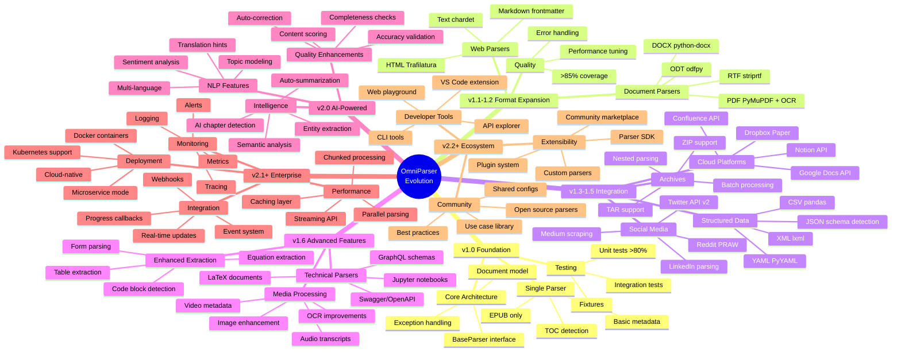
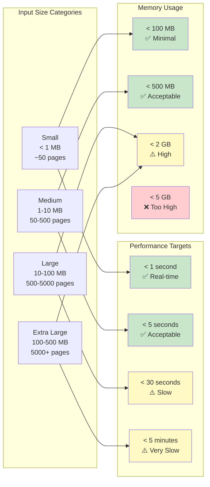

# OmniParser: Comprehensive Workflow & Architecture
**Universal Content Ingestion Platform**

**Version:** 2.0 (Expanded Vision)
**Date:** 2025-10-17
**Status:** Architecture Design

---

## Table of Contents
1. [System Overview](#system-overview)
2. [Input Source Taxonomy](#input-source-taxonomy)
3. [Parser Routing & Selection](#parser-routing--selection)
4. [Processing Pipeline](#processing-pipeline)
5. [Integration Patterns](#integration-patterns)
6. [Future Roadmap](#future-roadmap)

---

## System Overview

### Complete End-to-End Flow

![[comprehensive-workflow_0_graph.png]]

---

## Input Source Taxonomy

### Detailed Source Classification

![[comprehensive-workflow_1_mindmap.png]]

---

## Parser Routing & Selection

### Intelligent Parser Selection Flow

![[comprehensive-workflow_4_graph.png]]

---

## Processing Pipeline

### Detailed Processing Stages

![[comprehensive-workflow_5_sequenceDiagram.png]]

---

## Integration Patterns

### How Consumers Use OmniParser

![[comprehensive-workflow_7_graph.png]]

### Specific Use Case: epub2tts Integration

![[comprehensive-workflow_8_mindmap.png]]

---

## Future Roadmap

### Expansion Phases (Beyond v1.0)

![[comprehensive-workflow_9_graph.png]]

### Parser Priority Matrix

```mermaid
graph TD
    subgraph HighPriority["🔴 HIGH PRIORITY - v1.0-1.2"]
        HP1[EPUB Parser<br/>✅ Phase 2.2 Active]
        HP2[PDF Parser<br/>📄 Universal format]
        HP3[DOCX Parser<br/>📝 Office docs]
        HP4[HTML/Web Parser<br/>🌐 Web content]
        HP5[Markdown Parser<br/>📝 Developer docs]
        HP6[Text Parser<br/>📄 Fallback option]
    end

    subgraph MediumPriority["🟡 MEDIUM PRIORITY - v1.3-1.5"]
        MP1[JSON Parser<br/>🔧 API data]
        MP2[XML Parser<br/>🔧 Structured data]
        MP3[RSS/Feed Parser<br/>📡 Syndication]
        MP4[Twitter/X Parser<br/>🐦 Social media]
        MP5[Reddit Parser<br/>🔴 Community content]
        MP6[Archive Parser<br/>📦 Batch processing]
        MP7[RTF Parser<br/>📄 Legacy docs]
        MP8[ODT Parser<br/>📄 Open formats]
    end

    subgraph LowPriority["🟢 LOW PRIORITY - v1.6+"]
        LP1[LinkedIn Parser<br/>💼 Professional content]
        LP2[Medium Parser<br/>📰 Blog platform]
        LP3[Google Docs Parser<br/>☁️ Cloud docs]
        LP4[Notion Parser<br/>📝 Knowledge base]
        LP5[Confluence Parser<br/>📚 Team wiki]
        LP6[Jupyter Parser<br/>💻 Notebooks]
        LP7[CSV Parser<br/>📊 Tabular data]
        LP8[YAML Parser<br/>⚙️ Config files]
    end

    subgraph FuturePriority["🔵 FUTURE - v2.0+"]
        FP1[Substack Parser<br/>📧 Newsletters]
        FP2[GitHub Parser<br/>💻 Code repos]
        FP3[Telegram Parser<br/>💬 Messaging]
        FP4[Discord Parser<br/>🎮 Community]
        FP5[Slack Parser<br/>💼 Workplace]
        FP6[Email Parser<br/>📧 Messages]
        FP7[Academic DB Parser<br/>🎓 Research]
        FP8[Legal Doc Parser<br/>⚖️ Specialized]
    end

    HighPriority -.->|After v1.2| MediumPriority
    MediumPriority -.->|After v1.5| LowPriority
    LowPriority -.->|After v1.6| FuturePriority

    style HighPriority fill:#ffebee,stroke:#c62828,stroke-width:3px
    style MediumPriority fill:#fff9c4,stroke:#f57f17,stroke-width:2px
    style LowPriority fill:#e8f5e9,stroke:#2e7d32,stroke-width:2px
    style FuturePriority fill:#e3f2fd,stroke:#1565c0,stroke-width:2px
```



### Feature Evolution Map



---

## Technical Specifications

### Parser Capability Matrix

| Parser | Status | Formats | Chapter Detection | Metadata | Images | Tables | Links | Code Blocks | Priority |
|--------|--------|---------|-------------------|----------|--------|--------|-------|-------------|----------|
| **EPUB** | 🏗️ In Progress | .epub | ✅ TOC-based | ✅ OPF | ✅ Yes | ⚠️ Basic | ✅ Yes | ⚠️ Basic | 🔴 Critical |
| **PDF** | 📋 Planned v1.1 | .pdf | ✅ Font-based | ✅ Properties | ✅ Yes | ✅ Advanced | ✅ Yes | ⚠️ Basic | 🔴 High |
| **DOCX** | 📋 Planned v1.1 | .docx, .doc | ✅ Style-based | ✅ Core Props | ✅ Yes | ✅ Advanced | ✅ Yes | ✅ Yes | 🔴 High |
| **HTML/Web** | 📋 Planned v1.1 | .html, URLs | ✅ Heading-based | ⚠️ Meta tags | ✅ Yes | ✅ Yes | ✅ Yes | ✅ Yes | 🔴 High |
| **Markdown** | 📋 Planned v1.2 | .md, .markdown | ✅ Heading-based | ✅ Frontmatter | ✅ Yes | ✅ Yes | ✅ Yes | ✅ Yes | 🔴 High |
| **Text** | 📋 Planned v1.2 | .txt | ⚠️ Heuristic | ❌ None | ❌ No | ❌ No | ⚠️ URL detection | ❌ No | 🟡 Medium |
| **RTF** | 📋 Planned v1.2 | .rtf | ⚠️ Basic | ⚠️ Limited | ⚠️ Limited | ⚠️ Limited | ⚠️ Limited | ❌ No | 🟢 Low |
| **ODT** | 📋 Planned v1.2 | .odt | ✅ Style-based | ✅ Yes | ✅ Yes | ✅ Yes | ✅ Yes | ✅ Yes | 🟢 Low |
| **JSON** | 📋 Planned v1.3 | .json | ⚠️ Schema-based | ✅ Structured | ⚠️ Embedded | ⚠️ Embedded | ✅ Yes | ✅ Yes | 🟡 Medium |
| **XML** | 📋 Planned v1.3 | .xml | ⚠️ XPath-based | ✅ Attributes | ⚠️ Embedded | ⚠️ Embedded | ✅ Yes | ⚠️ CDATA | 🟡 Medium |
| **RSS/Atom** | 📋 Planned v1.3 | RSS, Atom feeds | ✅ Per-item | ✅ Feed metadata | ✅ Yes | ❌ No | ✅ Yes | ⚠️ Limited | 🟡 Medium |
| **CSV** | 📋 Planned v1.3 | .csv | ❌ Row-based | ⚠️ Headers | ❌ No | ✅ Native | ❌ No | ❌ No | 🟢 Low |
| **Twitter/X** | 📋 Planned v1.4 | API | ⚠️ Thread-based | ✅ User/tweet | ✅ Yes | ❌ No | ✅ Yes | ⚠️ Limited | 🟡 Medium |
| **Reddit** | 📋 Planned v1.4 | API | ✅ Comment threads | ✅ Submission | ✅ Yes | ❌ No | ✅ Yes | ✅ Yes | 🟡 Medium |
| **LinkedIn** | 📋 Planned v1.4 | Web/API | ⚠️ Heuristic | ✅ Profile | ✅ Yes | ❌ No | ✅ Yes | ⚠️ Limited | 🟢 Low |
| **Medium** | 📋 Planned v1.4 | Web | ✅ Heading-based | ✅ Author/article | ✅ Yes | ⚠️ Limited | ✅ Yes | ✅ Yes | 🟢 Low |
| **Google Docs** | 📋 Planned v1.5 | API | ✅ Style-based | ✅ Doc properties | ✅ Yes | ✅ Yes | ✅ Yes | ✅ Yes | 🟢 Low |
| **Notion** | 📋 Planned v1.5 | API | ✅ Block-based | ✅ Page properties | ✅ Yes | ✅ Yes | ✅ Yes | ✅ Yes | 🟢 Low |
| **Confluence** | 📋 Planned v1.5 | API/Web | ✅ Heading-based | ✅ Page metadata | ✅ Yes | ✅ Yes | ✅ Yes | ✅ Yes | 🟢 Low |
| **ZIP/Archive** | 📋 Planned v1.5 | .zip, .tar | ✅ Per-file | ⚠️ Aggregate | ✅ Yes | ✅ Yes | ✅ Yes | ✅ Yes | 🟡 Medium |
| **Jupyter** | 📋 Planned v1.6 | .ipynb | ✅ Cell-based | ✅ Notebook meta | ✅ Yes | ✅ Yes | ✅ Yes | ✅ Yes | 🟢 Low |

**Legend:**
- ✅ Fully Supported
- ⚠️ Partially Supported / Basic Implementation
- ❌ Not Supported
- 🏗️ In Progress
- 📋 Planned
- 🔴 Critical Priority
- 🟡 Medium Priority
- 🟢 Low Priority

---

## Configuration & Customization

### Parser Options Reference

```yaml
# Example: Universal parser options structure
parse_document:
  # Input options
  input:
    file_path: "path/to/file" or "https://url" or data
    encoding: "auto" # or specific encoding
    fallback_encoding: "utf-8"

  # Format detection
  format_detection:
    use_magic_bytes: true
    use_extension: true
    use_content_sniffing: true
    confidence_threshold: 0.8

  # Processing options
  processing:
    extract_images: true
    image_format: "reference" # or "base64" or "save"
    image_directory: "./images"

    detect_chapters: true
    chapter_detection_method: "auto" # toc, heading, pattern, heuristic
    min_chapter_length: 100 # words

    clean_text: true
    cleaning_patterns: "config/cleaning_patterns.yaml"
    remove_footnotes: true
    normalize_whitespace: true
    fix_encoding: true

    extract_metadata: true
    metadata_sources: ["native", "heuristic", "custom"]

    extract_tables: false # advanced feature
    preserve_code_blocks: true
    preserve_links: true

  # Output options
  output:
    format: "Document" # standard object
    markdown_flavor: "gfm" # GitHub Flavored Markdown
    include_toc: false
    include_reading_time: true

  # Performance options
  performance:
    max_file_size: "500MB"
    timeout: 300 # seconds
    parallel_parsing: false # for archives
    cache_enabled: false

  # Error handling
  error_handling:
    on_error: "raise" # or "warn" or "skip"
    collect_warnings: true
    verbose_errors: true

  # Parser-specific options
  parser_specific:
    epub:
      use_toc: true
      use_spine_fallback: true
      extract_cover: true

    pdf:
      ocr_enabled: true
      ocr_language: "eng"
      extract_tables: false
      detect_scanned: true

    web:
      use_trafilatura: true
      use_readability: true # fallback
      fetch_timeout: 30
      user_agent: "OmniParser/2.0"
      javascript_enabled: false # future: playwright

    social:
      twitter:
        include_replies: false
        include_retweets: false
        thread_detection: true
      reddit:
        include_comments: true
        max_comment_depth: 5
        sort_by: "best"
```

---

## Performance Benchmarks

### Target Performance Goals



---

## Conclusion

This comprehensive workflow demonstrates **OmniParser's vision as a universal content ingestion platform**:

### Key Capabilities

1. **Universal Input Support**: 20+ input sources (documents, web, social, feeds, cloud, code, data)
2. **Intelligent Routing**: Automatic format detection and parser selection
3. **Standardized Output**: Unified `Document` model across all formats
4. **Extensible Architecture**: Easy to add new parsers and features
5. **Production Ready**: Built on proven code from epub2tts

### Strategic Value

- **For epub2tts**: Enables universal input (not just EPUB)
- **For RAG Systems**: Consistent document structure for knowledge bases
- **For Content Platforms**: Unified ingestion pipeline
- **For Developers**: Clean API, extensive documentation, active development

### Next Steps

1. **Phase 2.2**: Complete EPUB parser extraction (in progress)
2. **v1.1**: Add PDF, DOCX, HTML/Web parsers
3. **v1.2-1.3**: Expand to structured data and social media
4. **v1.4-1.5**: Cloud platforms and archives
5. **v2.0+**: AI-powered features and enterprise capabilities

**OmniParser: Parse Anything. Output Consistency. Build Everywhere.**

---

**Document Version:** 2.0
**Last Updated:** 2025-10-17
**Status:** Comprehensive Vision
**Next Action:** Complete EPUB parser (Phase 2.2)
