# OmniParser Architecture Diagrams (Mermaid)
**Visual reference for OmniParser architecture**

---

## System Context Diagram

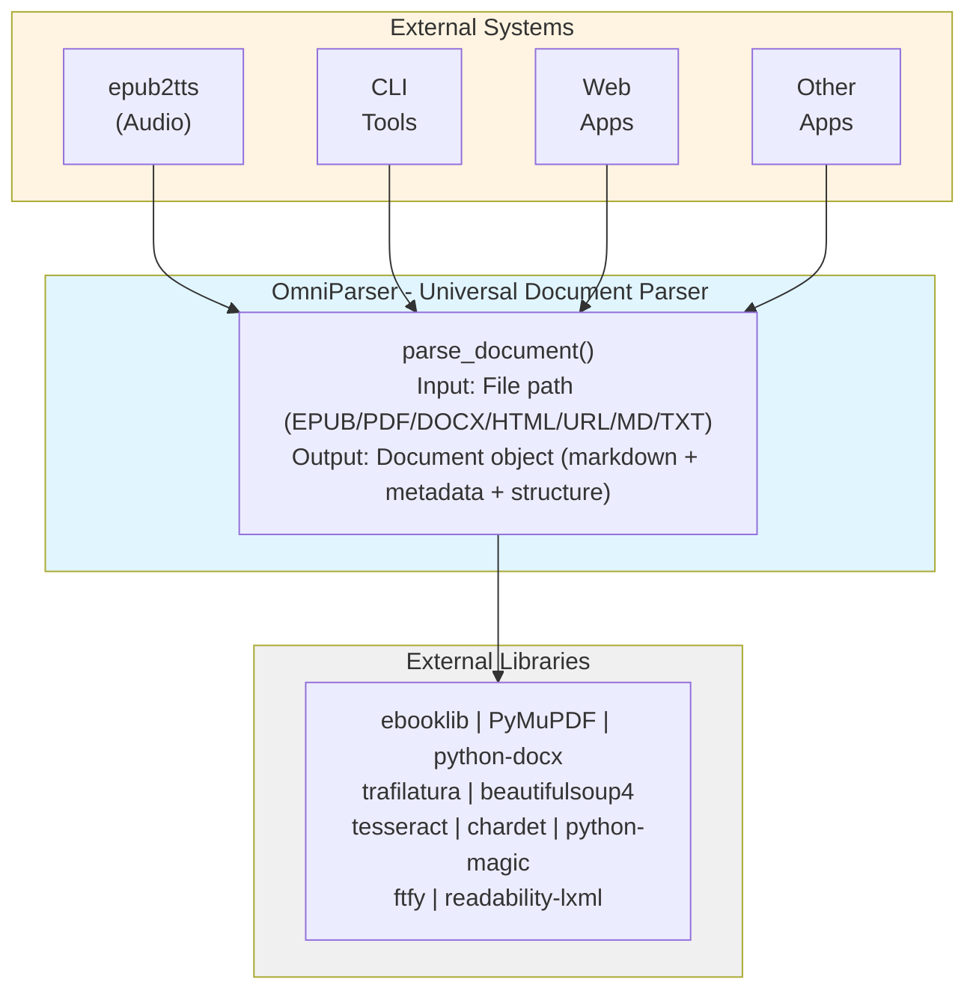

---

## Layered Architecture

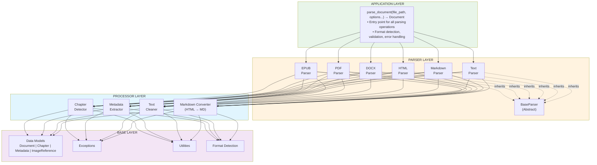

---

## Parser Flow Diagram

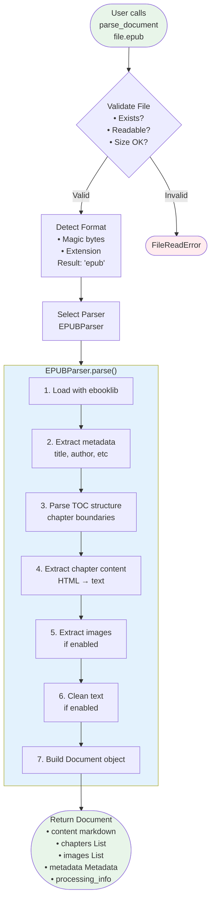

---

## Document Object Structure

```mermaid
graph TD
    Doc[Document]
    
    Doc --> id["document_id: uuid-1234-5678"]
    Doc --> content["content: Full text as markdown..."]
    Doc --> wc["word_count: 50000"]
    Doc --> time["estimated_reading_time: 250 min"]
    
    Doc --> Chapters[chapters: List]
    Chapters --> Ch0[Chapter 0]
    Chapters --> Ch1[Chapter 1]
    Chapters --> ChN[Chapter N...]
    
    Ch0 --> ch0id["chapter_id: 0"]
    Ch0 --> ch0title["title: Prologue"]
    Ch0 --> ch0content["content: Chapter text..."]
    Ch0 --> ch0start["start_position: 0"]
    Ch0 --> ch0end["end_position: 500"]
    Ch0 --> ch0wc["word_count: 100"]
    Ch0 --> ch0level["level: 1"]
    Ch0 --> ch0meta["metadata: {}"]
    
    Doc --> Images[images: List]
    Images --> Img0[ImageReference 0]
    Images --> ImgN[ImageReference N...]
    
    Img0 --> imgid["image_id: img_001"]
    Img0 --> imgpos["position: 1500"]
    Img0 --> imgpath["file_path: /path/to/image.jpg"]
    Img0 --> imgalt["alt_text: Description"]
    Img0 --> imgsize["size: 800, 600"]
    Img0 --> imgfmt["format: jpg"]
    
    Doc --> Metadata[metadata: Metadata]
    Metadata --> mtitle["title: Book Title"]
    Metadata --> mauthor["author: Author Name"]
    Metadata --> mauthors["authors: [Author 1, Author 2]"]
    Metadata --> mpub["publisher: Publisher Inc."]
    Metadata --> mdate["publication_date: 2024-01-01"]
    Metadata --> mlang["language: en"]
    Metadata --> misbn["isbn: 978-0-123456-78-9"]
    Metadata --> mdesc["description: Book description..."]
    Metadata --> mtags["tags: [fiction, fantasy]"]
    Metadata --> mfmt["original_format: epub"]
    Metadata --> msize["file_size: 2048000"]
    Metadata --> mcustom["custom_fields: {}"]
    
    Doc --> Processing[processing_info: ProcessingInfo]
    Processing --> pparser["parser_used: epub"]
    Processing --> pver["parser_version: 1.0.0"]
    Processing --> ptime["processing_time: 2.5s"]
    Processing --> pts["timestamp: 2025-10-16 12:00:00"]
    Processing --> pwarn["warnings: []"]
    Processing --> popts["options_used: {extract_images: true}"]
    
    style Doc fill:#e1f5fe
    style Chapters fill:#fff3e0
    style Images fill:#f3e5f5
    style Metadata fill:#e8f5e9
    style Processing fill:#fce4ec
```

---

## EPUB Parser Internal Flow

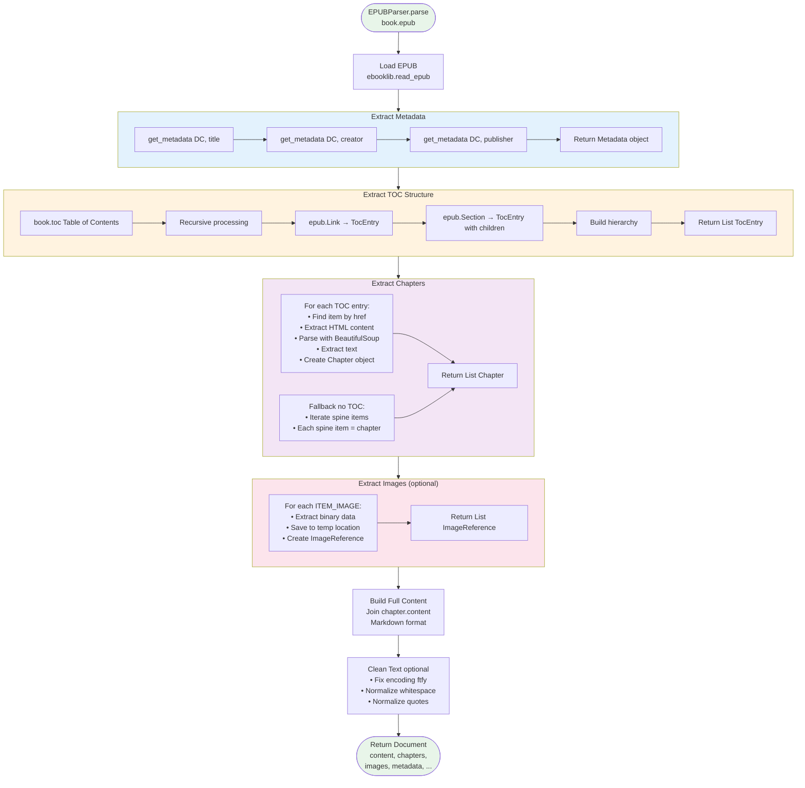

---

## Parser Inheritance Hierarchy

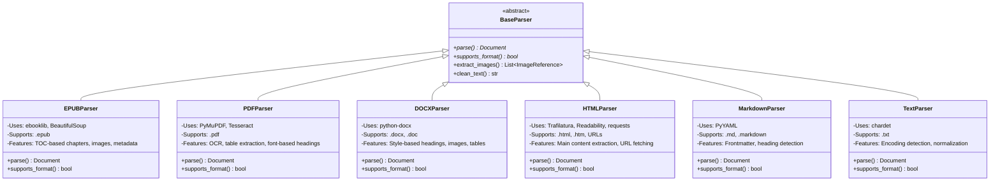

---

## Data Flow: epub2tts Integration

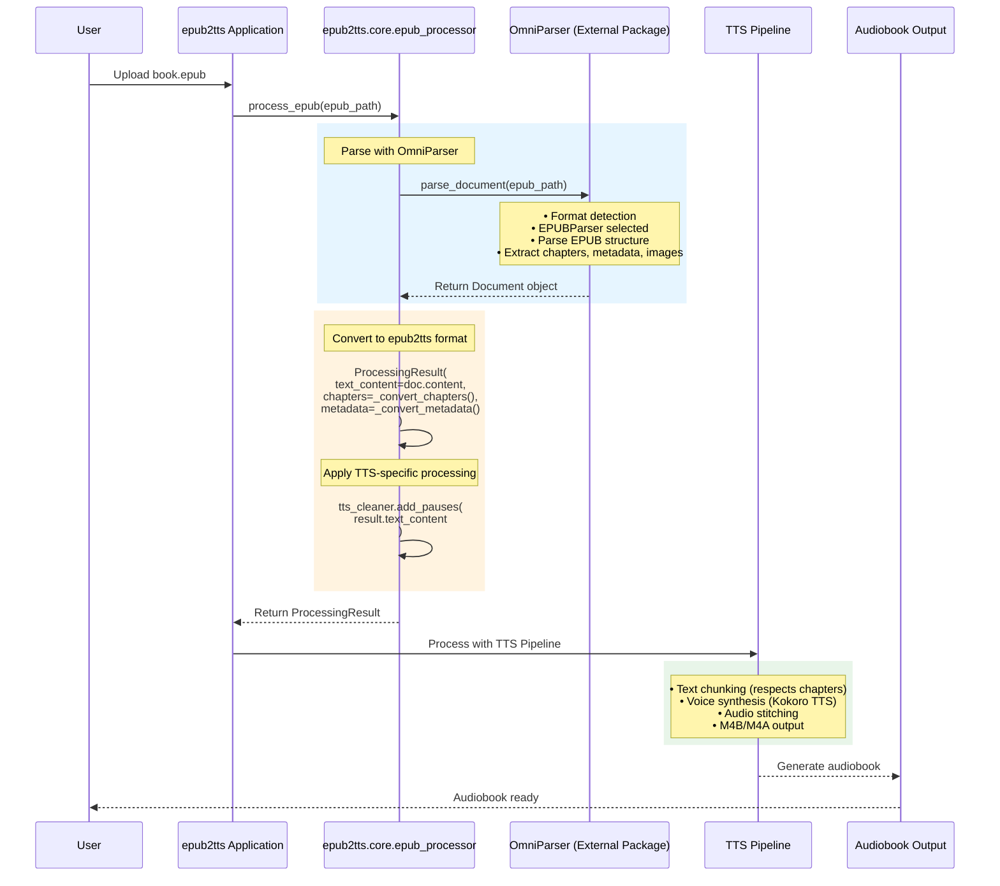

---

## Error Handling Flow

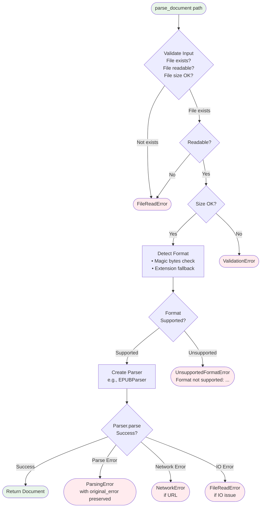

---

## Testing Structure

```mermaid
graph TD
    Tests[tests/]
    
    Tests --> Unit[unit/<br/>Unit tests - fast, isolated]
    Tests --> Integration[integration/<br/>Integration tests - slower, end-to-end]
    Tests --> Fixtures[fixtures/<br/>Test data]
    
    Unit --> UnitModels[test_models.py<br/>Data model tests]
    Unit --> UnitEPUB[test_epub_parser.py<br/>EPUB parser tests]
    Unit --> UnitPDF[test_pdf_parser.py<br/>PDF parser tests]
    Unit --> UnitDOCX[test_docx_parser.py<br/>DOCX parser tests]
    Unit --> UnitHTML[test_html_parser.py<br/>HTML parser tests]
    Unit --> UnitMD[test_markdown_parser.py<br/>Markdown parser tests]
    Unit --> UnitText[test_text_parser.py<br/>Text parser tests]
    Unit --> UnitFormat[test_format_detector.py<br/>Format detection tests]
    Unit --> UnitCleaner[test_text_cleaner.py<br/>Text cleaning tests]
    Unit --> UnitChapter[test_chapter_detector.py<br/>Chapter detection tests]
    Unit --> UnitExcept[test_exceptions.py<br/>Exception tests]
    
    UnitModels --> M1[test_document_creation]
    UnitModels --> M2[test_document_serialization]
    UnitModels --> M3[test_chapter_helpers]
    UnitModels --> M4[test_metadata_fields]
    
    UnitEPUB --> E1[test_parse_valid_epub]
    UnitEPUB --> E2[test_parse_no_toc]
    UnitEPUB --> E3[test_metadata_extraction]
    UnitEPUB --> E4[test_chapter_detection]
    UnitEPUB --> E5[test_image_extraction]
    
    Integration --> IPipeline[test_full_pipeline.py<br/>parse_document with all formats]
    Integration --> IFormat[test_format_detection.py<br/>Format detection integration]
    Integration --> IError[test_error_handling.py<br/>Error scenarios]
    Integration --> ISerial[test_serialization.py<br/>JSON save/load tests]
    
    Fixtures --> F1[sample.epub - Valid EPUB]
    Fixtures --> F2[no_toc.epub - EPUB without TOC]
    Fixtures --> F3[images.epub - EPUB with images]
    Fixtures --> F4[sample.pdf - Text-based PDF]
    Fixtures --> F5[scanned.pdf - OCR PDF]
    Fixtures --> F6[sample.docx - DOCX with formatting]
    Fixtures --> F7[sample.html - HTML article]
    Fixtures --> F8[sample.md - Markdown with frontmatter]
    Fixtures --> F9[sample.txt - Plain text]
    
    style Tests fill:#e1f5fe
    style Unit fill:#fff3e0
    style Integration fill:#f3e5f5
    style Fixtures fill:#e8f5e9
```

---

## Package Structure

```mermaid
graph TD
    Root[omniparser/]
    
    Root --> Config[pyproject.toml<br/>UV package configuration]
    Root --> README[README.md<br/>User-facing documentation]
    Root --> LICENSE[LICENSE<br/>MIT License]
    Root --> CHANGELOG[CHANGELOG.md<br/>Version history]
    Root --> GitIgnore[.gitignore<br/>Git ignore rules]
    
    Root --> Src[src/]
    Src --> Package[omniparser/]
    
    Package --> Init[__init__.py<br/>Exports: parse_document,<br/>Document, exceptions]
    Package --> Parser[parser.py<br/>Main parse_document function<br/>Entry point, format detection]
    Package --> Models[models.py<br/>Document, Chapter, Metadata,<br/>ImageReference, ProcessingInfo]
    Package --> Exceptions[exceptions.py<br/>OmniparserError, ParsingError, etc.]
    
    Package --> BaseDir[base/]
    BaseDir --> BaseInit[__init__.py]
    BaseDir --> BaseParser[base_parser.py<br/>BaseParser ABC]
    
    Package --> ParsersDir[parsers/]
    ParsersDir --> ParsersInit[__init__.py]
    ParsersDir --> EPUB[epub_parser.py<br/>EPUBParser ported from epub2tts]
    ParsersDir --> PDF[pdf_parser.py<br/>PDFParser PyMuPDF + OCR]
    ParsersDir --> DOCX[docx_parser.py<br/>DOCXParser python-docx]
    ParsersDir --> HTML[html_parser.py<br/>HTMLParser Trafilatura]
    ParsersDir --> MD[markdown_parser.py<br/>MarkdownParser]
    ParsersDir --> Text[text_parser.py<br/>TextParser chardet]
    
    Package --> ProcessorsDir[processors/]
    ProcessorsDir --> ProcessorsInit[__init__.py]
    ProcessorsDir --> ChapterDet[chapter_detector.py<br/>Heading-based detection]
    ProcessorsDir --> MetaExt[metadata_extractor.py<br/>Metadata extraction]
    ProcessorsDir --> MDConv[markdown_converter.py<br/>HTML → Markdown]
    ProcessorsDir --> TextClean[text_cleaner.py<br/>Text normalization]
    
    Package --> UtilsDir[utils/]
    UtilsDir --> UtilsInit[__init__.py]
    UtilsDir --> FormatDet[format_detector.py<br/>Magic bytes detection]
    UtilsDir --> Encoding[encoding.py<br/>Encoding utilities]
    UtilsDir --> Validators[validators.py<br/>Input validation]
    
    Root --> TestsDir[tests/]
    TestsDir --> TestsInit[__init__.py]
    TestsDir --> Conftest[conftest.py<br/>Pytest configuration]
    TestsDir --> UnitTests[unit/<br/>Unit tests]
    TestsDir --> IntTests[integration/<br/>Integration tests]
    TestsDir --> TestFixtures[fixtures/<br/>Test data files]
    
    Root --> DocsDir[docs/]
    DocsDir --> DocsIndex[index.md<br/>Main docs]
    DocsDir --> DocsAPI[api.md<br/>API reference]
    DocsDir --> DocsParsers[parsers.md<br/>Parser implementation guide]
    DocsDir --> DocsContrib[contributing.md<br/>Contribution guide]
    
    Root --> ExamplesDir[examples/]
    ExamplesDir --> ExBasic[basic_usage.py<br/>Simple example]
    ExamplesDir --> ExBatch[batch_processing.py<br/>Process directory]
    ExamplesDir --> ExCustom[custom_parser.py<br/>Custom parser implementation]
    
    style Root fill:#e1f5fe
    style Src fill:#fff3e0
    style Package fill:#e8f5e9
    style BaseDir fill:#f3e5f5
    style ParsersDir fill:#fce4ec
    style ProcessorsDir fill:#fff9c4
    style UtilsDir fill:#e0f2f1
    style TestsDir fill:#fce4ec
    style DocsDir fill:#f3e5f5
    style ExamplesDir fill:#fff3e0
```

---

## Version 1.0 Scope

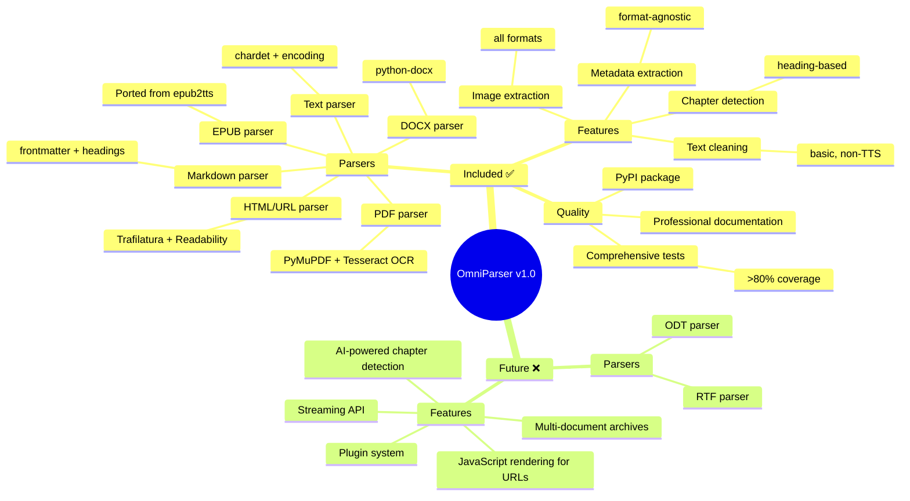

---

## Deployment Pipeline

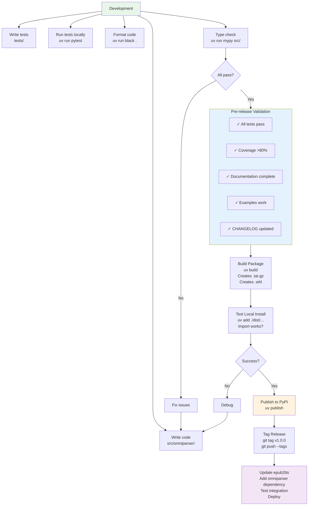

---

**Last Updated:** October 16, 2025  
**Status:** Mermaid Conversion Complete  
**Original Source:** ARCHITECTURE_DIAGRAMS.md
